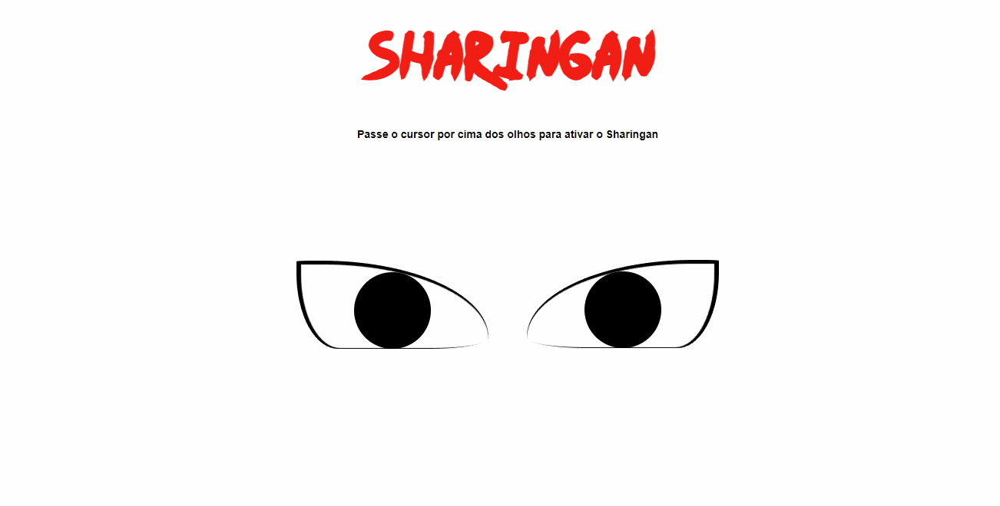

<h1 align="center"><a href="https://emoji.gg/emoji/sharingan"></a>Ative seu Sharingan<a href="https://emoji.gg/emoji/sharingan"></a></h1>
<a href="https://emoji.gg/emoji/sharingan"></a>
 
<h3 align="left">Descrição</h3> 
 
<p align="left">Projeto desenvolvido apenas com CSS para desenhar o famoso "Sharingan" do anime Naruto.</p>
 
 <h4 align="left">Projeto</h4>
<p>Neste projeto utilizei CSS puro para fazer o desenho e as animações.</p>
 
## 📦 Instalação

#### Clone o repositório na pasta desejada: 
```bash
https://github.com/MarcusHolanda1/sharinganOnlyCSS.git
```
#### Rode o projeto index.html no local desejado: 
```bash
src > index.html
```
<br/>
<br/>
<br/>
<h1 align="center">Divirta-se ativando seu Sharingan</h1>
<p align="Center">
    
</p>


